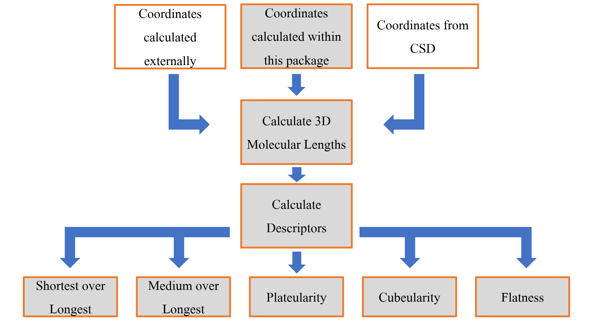
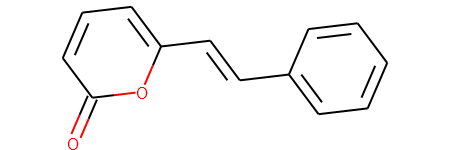

# Molecular3DLengthDescriptors

### Introduction

The **Molecular3DLengthDescriptors** package can do the following:

1. Calculates the lowest energy 3D conformer of a molecule using RDKit's UFF and MFF94 force fields.
2. Converts an array of coordinates into a set of lengths: longest, medium and shortest.
3. Descriptors can be calculated from these lengths.

### Applications

You can use this tool to do the following:

- Calculate these descriptors for a machine learning project from 2D SMILES input.
- Calculate these descriptors using crystallogaphic molecular coordinates exported from a database such as the CSD.
- Calculate these descriptors using coordinates calculated via another method (eg: GROMACS, BALLOON, CONFAB... etc)

### Installation

Installation of this package requires Python 3+. 

You can install this package two ways...

via pip:

`pip install Molecular3DLengthDescriptors`

(https://pypi.org/project/Molecular3DLengthDescriptors/)

Or manually, by placing the Molecular3DLengthDescriptors folder within 

`~/.local/lib/pythonX.X/site-packages`

The `rdkit` and `numpy` libraries are dependencies for this package. Install them with the following:

`conda install numpy`

https://www.rdkit.org/docs/Install.html

### How Molecular3DLengthDescriptors module works



1. Import package


```python
import Molecular3DLengthDescriptors as md
```
    

2. Calculate 3D coordinates of 2D molecule

This uses code is based off Wicker et al's nConf20 descriptor (10.1021/acs.jcim.6b00565).

```python
from rdkit.Chem import MolFromSmiles

smiles = "O=c1cccc(/C=C/c2ccccc2)o1"
mol_2D = MolFromSmiles(smiles)
mol_2D
```





```python
cc = md.Lengths.ComputeCoordsFrom2D()
coordinates = cc.GetCoords(mol_2D)
coordinates
```


    array([[ 4.19392625, -2.10217421,  1.20758067],
           [ 3.77614639, -1.12343758,  0.59832016],
           [ 4.72136167, -0.18159364, -0.02926615],
           [ 4.27935864,  0.88880918, -0.69605956],
           [ 2.87057618,  1.13819338, -0.81141094],
           [ 2.00047091,  0.2903415 , -0.24586024],
           [ 0.56197146,  0.46799511, -0.31472371],
           [-0.34101042, -0.35981258,  0.23919665],
           [-1.81020273, -0.21901879,  0.19470342],
           [-2.47547343,  0.83154283, -0.45235907],
           [-3.87295236,  0.9032948 , -0.45516855],
           [-4.62630912, -0.07414675,  0.18888447],
           [-3.98359642, -1.12449045,  0.8365183 ],
           [-2.58741845, -1.19525503,  0.83872962],
           [ 2.44345336, -0.85157198,  0.4663684 ]])


3. Calculate the lengths of the 3D molecule

The covariance of the molecular coordinates is calculated. Then eigenvectors and eigenvalues from the covariance matrix is calculated. The eigenvectors will be aligned in directions of most variance, least variance and right angles to both of those. Therefore, if the square root of the eigenvalues is taken these values will now be back on the same unit scale as the coordinates and hence can be interpreted as the lengths of the molecule. 


```python
lengths = md.Lengths.GetLengthsFromCoords(coordinates)
lengths
```


    [0.0001053619852081641, 1.124146300889793, 3.3578154223541476]


4. Calculate descriptors

You can calculate individual descriptors:


```python
print(md.Descriptors.Flatness(lengths))
print(md.Descriptors.Cubeularity(lengths))
print(md.Descriptors.Plateularity(lengths))
print(md.Descriptors.ShortOverLong(lengths))
print(md.Descriptors.MediumOverLong(lengths))
```

    0.0001053619852081641
    1.0504929488912333e-05
    35825.784590642164
    3.1378134875053776e-05
    0.334785019273531
    

Or all at once:


```python
md.Descriptors.CalcAllDesc(lengths)
```


    {'Flattness': 0.0001053619852081641,
     'Cubeularity': 1.0504929488912333e-05,
     'Plateularity': 35825.784590642164,
     'ShortOverLong': 3.1378134875053776e-05,
     'MediumOverLong': 0.334785019273531}


### Explainations of descriptors

To explain what the descriptors mean, place `help(...)` around the function to output the docstring.


```python
help(md.Descriptors.ShortOverLong)
```

    Help on function ShortOverLong in module Molecular3DLengthDescriptors.Descriptors:
    
    ShortOverLong(lengths)
        A measure of how cubic a molecules is.
        
        0 means either a needle or plate shape.
        1 means perfect cube
        
        ShortOverLong = Shortest / Longest
    
    


```python
help(md.Descriptors.CalcAllDesc)
```

    Help on function CalcAllDesc in module Molecular3DLengthDescriptors.Descriptors:
    
    CalcAllDesc(lengths)
        Flattness => Shortest length
            Measure of how flat a molecules is.
        
        Cubularity => (Shortest*Medium*Longest)/(Longest)**3
            1 is a perfect cube. 
        
        Plateularity => (Medium*Longest)/ Shortest
            Larger value, more 2D plate-like.
            
        ShortOverLong => Shortest / Longest
            1 is perfect cube, 0 is needle or plate-like
            
        MediumOverLong => Medium / Longest
            1 is perfect plate-like shape, 0 is perfect needle shape
    
    

### Reference

If you use this package please feel free to reference us with:

Jewson, T., & Cooper, R. I. (2021). Molecular3DLengthDescriptors (1.0.0). https://github.com/ThomasJewson/Molecular3DLengthDescriptors

Or add this BibTeX entry to your .bib library:
```
@misc{Jewson2021,
author = {Jewson, Thomas and Cooper, Richard I.},
title = {{Molecular3DLengthDescriptors}},
url = {https://github.com/ThomasJewson/Molecular3DLengthDescriptors},
year = {2021}
}
```
